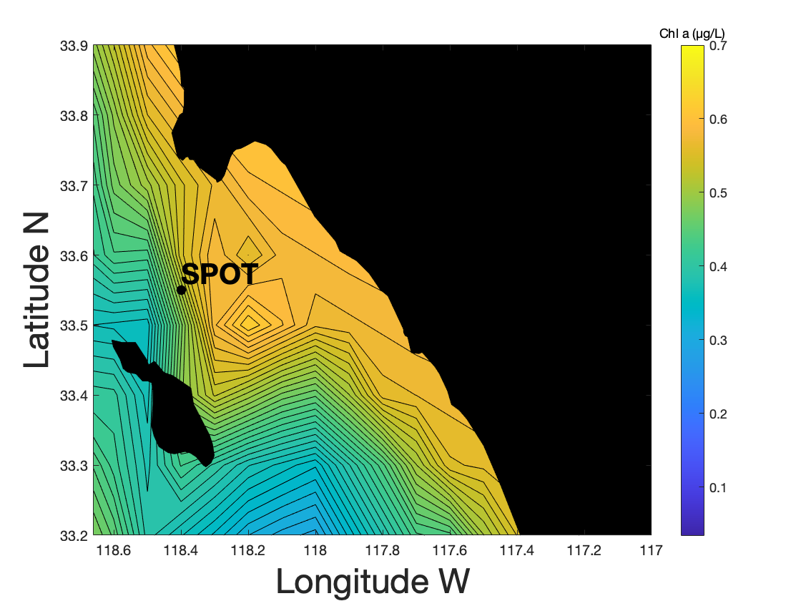

# MATLAB_ContourMap
### By: Samantha J. Gleich
### Last Modified: June 17, 2022
This repository will walk you through how to overlay a map image on top of a contour plot in MATLAB. This repository contains an R script that can be used to convert nc data (data type that is often downloaded from satellite data repositories e.g. CMEMS) to a 3D (x,y,z) csv dataframe. This csv file will then be used in MATLAB to create a contour of variable z across longitude (x) and latitude (y).

\

This tutorial will produce the plot above. This is an contour plot of the satellite-derived chlorophyll a concentrations observed on June 4, 2022 near the San Pedro Ocean Time-series monitoring station. The data used to make this plot were obtained from CMEMS

## 1.) CMEMS data download
Satellite data (e.g. chlorophyll, sea surface height, etc.) can be downloaded through the Copernicus Marine Service website (https://marine.copernicus.eu). This site will allow you to download your z variable of interest (to be contoured) at your desired latitude and longitude. 

## 2.) R (nc_to_csv.R)
Use R to convert the .nc file from CMEMs to a csv file for MATLAB. The R script in this repository will require the use of one package:
- `raster`

## 3.) MATLAB (Contour_Map_Tutorial.m)
Use MATLAB to load in x, y, z csv data, plot contours, and overlay a map image. The map images will require the use of the MATLAB Mapping toolbox (https://www.mathworks.com/products/mapping.html), which is available for free with a university MATLAB subscription. 
